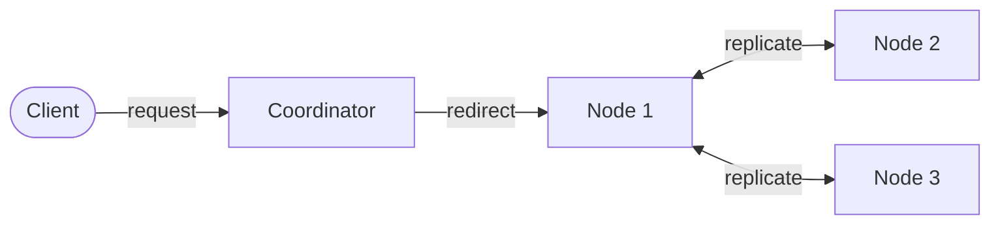

# KVCluster

A distributed, Redis-inspired key-value store built from scratch in Java 25.

## Tech stack

- **Java 25** — virtual threads for HTTP executors and background health checks
- **[JBang](https://www.jbang.dev/)** — dependency management and script execution, no build tool
- **[Gson](https://github.com/google/gson)** — JSON (de)serialization
- **[SLF4J](https://www.slf4j.org/)** — logging
- **[JUnit](https://junit.org/)** — tests
- **[picocli](https://picocli.info/)** — CLI argument parsing and colored terminal output
- **`com.sun.net.httpserver`** — the JDK-bundled HTTP server (no external web framework)

## Architecture



1. Client sends a request to the coordinator.
2. Coordinator redirects it to the node that owns the key.
3. That node replicates the write to its peers.

The coordinator also spawns, health-checks, restarts, and (if necessary) evicts nodes in the background.

## Features

### Consistent hashing
Nodes and keys are hashed onto the same circular ring (`ConsistentNodeHashService`), each physical node represented by ~100 virtual positions to even out load. A key belongs to whichever node is next on the ring walking clockwise from the key's hash, so adding or removing a node only reshuffles a small slice of keys, not the whole keyspace.

### Replication
Each node is told its replica peers (computed from the ring, independent of total node count) at spawn time. On a write, the primary node replicates asynchronously to its peers, tagging the forwarded request with `X-Replication-Write: true` so peers know not to forward it again, this is what keeps replication to a single hop instead of cascading.

### Routing with failover
The coordinator doesn't just route to a key's primary owner, it walks the primary + replica set in order and redirects to the first node currently marked healthy. If the primary is down, the client transparently lands on a replica instead.

### Failure detection & self-healing
A background health monitor polls every node on an interval. When a node stops responding:
1. It's immediately pulled out of the hash ring so routing stops sending traffic there.
2. The coordinator attempts to restart it once, using its original spawn parameters (port, peers).
3. If it's still unhealthy after the restart attempt, it's permanently evicted from the pool (data migration to cover its share of the keyspace is intentionally out of scope — see below).

### Persistence (write-ahead log)
Every `PUT`/`DELETE` is appended to a per-node log file (`data/<node-id>.log`) before being applied in memory. On startup, each node replays its own log to rebuild its in-memory state — so a node survives a crash or restart without losing data.

### CLI client
A `picocli`-based CLI talks to the coordinator like any other client:
```bash
jbang CLI.java store put foo bar
jbang CLI.java store get foo
jbang CLI.java store del foo
jbang CLI.java nodes list
jbang CLI.java nodes get node-2
```
Output uses picocli's built-in ANSI markup (auto-disabled when output isn't a real terminal), and errors (timeouts, unreachable coordinator) are handled with clear messages and proper non-zero exit codes.

## Running it

Requires [JBang](https://www.jbang.dev/) (dependencies declared inline via `//DEPS` — no Maven/Gradle).

**Start the cluster:**
```bash
jbang Coordinator.java --nodes=5 --replication=2
```

**Talk to it via the CLI:**
```bash
jbang CLI.java store put foo bar
jbang CLI.java store get foo
jbang CLI.java store del foo
jbang CLI.java nodes list
```

**Or talk to it directly with an HTTP client** (e.g. [httpie](https://httpie.io/)):
```bash
http PUT "http://localhost:9000/" key=foo value=bar
```
Note: the coordinator's `307` redirects preserve method and body per spec, but many HTTP clients (including plain `HttpClient` defaults across several languages) don't reliably resend the body when auto-following a `307`/`308`. The bundled CLI handles this correctly by following redirects manually; if you're testing with `curl`/`httpie` directly, use `--follow`/`-F` and verify the body actually lands.

## API

All endpoints accept/return JSON, except `GET`, which takes `key` as a query parameter (`?key=foo`) rather than a body — GET request bodies are unreliably supported across HTTP clients and intermediaries, so this project avoids relying on them.

| Method | Input | Response |
|---|---|---|
| `PUT /` | body: `{"key": "...", "value": "..."}` | `{"success": true, "key": "..."}` |
| `GET /?key=...` | query param | `{"found": bool, "key": "...", "value": "..." \| null}` |
| `DELETE /` | body: `{"key": "..."}` | `{"deleted": true, "key": "..."}` |
| `GET /nodes` | — | `{"nodes": [{"id": "...", "url": "...", "healthy": bool}, ...]}` |

Every node response includes an `X-Node-Id` header identifying which node handled it. Errors return `4xx`/`5xx` with a plain-text or JSON message body.
