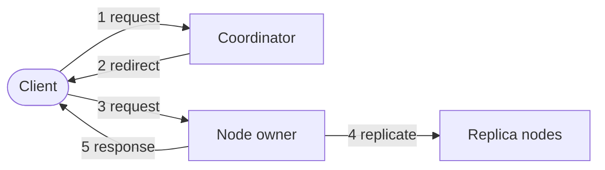

# kv-clusters

A distributed, Redis-inspired key-value store built from scratch in Java 25, used as a learning project for distributed systems concepts: consistent hashing, node coordination, replication, and (eventually) failure detection and persistence.

Each "node" is an independent process that stores data in memory and exposes a simple HTTP API (`PUT` / `GET` / `DELETE`). A **coordinator** process spawns and tracks nodes, routes client requests to the correct node using consistent hashing, and (eventually) monitors node health.

## Why this exists

This is a learning project, not a production system. The goal is to build and understand the core mechanisms real distributed key-value stores (Redis Cluster, Cassandra, DynamoDB) rely on.

## Architecture



1. Client sends a request to the coordinator.
2. Coordinator hashes the key and redirects the client to the node that owns it.
3. Client sends the same request directly to that node.
4. The node replicates the write to its peers asynchronously.
5. The node responds to the client.

The coordinator also spawns and health-checks every node process, separately from this request path.

**Two process roles:**

- **Coordinator** — a single long-lived process. On startup, it spawns N node processes (each as a separate OS process via `ProcessBuilder`/JBang), builds a consistent-hashing ring over them, and runs its own small HTTP server. It does **not** sit in the hot path for every request — it only tells clients which node to talk to.
- **Node** — an independent HTTP server + in-memory key-value store. Each node knows the full set of its peer nodes (handed to it by the coordinator at startup) and is responsible for replicating writes to them directly.

**Why nodes are separate OS processes (not threads in one JVM):** this is deliberate. It means a node can crash independently without taking down the whole cluster or the coordinator — closer to how a real distributed system behaves, and a better basis for testing failure detection later.

## How a request flows

1. Client sends `PUT http://localhost:9000/` with `{"key": "foo", "value": "bar"}` to the **coordinator**.
2. Coordinator peeks at the `key` field, hashes it onto its consistent-hashing ring, and figures out which node owns it.
3. Coordinator responds with an HTTP `307 Temporary Redirect` pointing at that node's address. `307` (not `301`/`302`) is used specifically because it preserves the original HTTP method *and* request body when followed — important since `PUT`/`DELETE` carry payloads.
4. The client (or an HTTP client with `--follow`/`-F`) re-sends the exact same request directly to that node.
5. The node stores the value locally, then **asynchronously forwards the write to its replica peers**, tagging the forwarded request with an `X-Replication-Write: true` header so peers know *not* to forward it again (this is what prevents infinite replication loops).
6. The node responds to the client, including an `X-Node-Id` header identifying which node actually handled the request.

## Consistent hashing (the routing mechanism)

Instead of naive `hash(key) % nodeCount` (which reshuffles almost every key whenever a node is added/removed), nodes and keys are hashed onto the same circular numeric space (a "ring"). A key belongs to whichever node is the next one found walking clockwise from the key's position.

Each physical node is hashed multiple times under different suffixes ("virtual nodes", ~100 per node) and scattered around the ring, which evens out load distribution across a small number of real nodes.

This logic lives in `ConsistentNodeHashService`, backed by a `TreeMap<Long, String>` — `tailMap()` does the "walk clockwise" for free, since the map stays sorted by ring position.

## Replication

Every node is given a map of its peers (`{"node-2": "http://localhost:4001", ...}`) directly by the coordinator at spawn time — no gossip protocol, no dynamic discovery, since the coordinator already knows the full topology the moment it spawns everything.

When a node receives an original client write, it replicates that write to all its peers, marking the forwarded request so peers don't replicate it further (depth-1 fan-out only, no recursion). Replication is currently fire-and-forget (async, no acknowledgement wait) — an intentional eventual-consistency tradeoff for now.

## Running it

Requires [JBang](https://www.jbang.dev/) (dependencies are declared inline via `//DEPS` — no separate build step or vendored jars).

**Start the coordinator** (spawns 3 nodes on ports 4000-4002, listens itself on 9000):
```bash
jbang Coordinator.java
```

**Talk to the cluster** (using [httpie](https://httpie.io/)):
```bash
# write a key — coordinator redirects to the owning node
http --follow PUT "http://localhost:9000/" key=foo value=bar

# read it back
http --follow GET "http://localhost:9000/" key=foo

# delete it
http --follow DELETE "http://localhost:9000/" key=foo
```

Add `-v` to see the `307` redirect and `X-Node-Id` response header directly:
```bash
http -v --follow PUT "http://localhost:9000/" key=foo value=bar
```

**Talk to a node directly** (bypassing the coordinator, useful for debugging):
```bash
http PUT "http://localhost:4000/" key=foo value=bar
```

## API

All endpoints accept/return JSON. `key` is always required.

| Method | Body | Response |
|---|---|---|
| `PUT` | `{"key": "...", "value": "..."}` | `{"success": true, "key": "..."}` |
| `GET` | `{"key": "..."}` | `{"found": bool, "key": "...", "value": "..." \| null}` |
| `DELETE` | `{"key": "..."}` | `{"deleted": true, "key": "..."}` |

Errors return `4xx`/`5xx` with a plain-text message body.

## Tech stack

- **Java 25** — compact source files / instance `main` methods (JEP 512), virtual threads for the HTTP executor
- **[JBang](https://www.jbang.dev/)** — dependency management and script execution, no Maven/Gradle
- **[Gson](https://github.com/google/gson)** — JSON (de)serialization
- **[SLF4J](https://www.slf4j.org/)** — logging
- **`com.sun.net.httpserver`** — the JDK-bundled HTTP server (no external web framework)

## Status / roadmap

See [`TODOS.md`](./TODOS.md) for the current in-progress and planned work.
